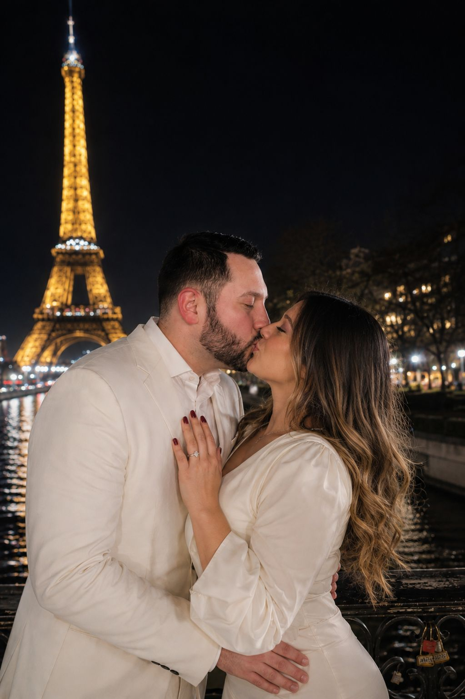

# 💚 Invitación de Boda - Dahiana & Manuel

Una invitación digital moderna e interactiva para la boda del 03.10.2026 en Cortijo Triana, Andújar.

## 🎯 Características

✨ **Sobre Interactivo**: Se abre con animación 3D suave
📸 **Foto de Pareja**: Aparece después de abrir el sobre
🌹 **Pétalos Cayendo**: Efecto realista cuando se abre
⏱️ **Countdown**: Contador en vivo hasta la boda
🎵 **Reproductor de Música**: Control de audio integrado
📍 **Google Maps**: Botón directo a la ubicación
💬 **WhatsApp**: Confirmación rápida y directa
📱 **100% Responsive**: Funciona en móvil, tablet y desktop

## 📂 Estructura de Archivos

```
dahiana-manuel-wedding/
├── index.html              # Estructura HTML
├── styles.css              # Estilos CSS
├── script.js               # Lógica JavaScript
├── foto_invitacion_de_boda.jpeg   # Foto de pareja
├── image_1.png             # Fondo floral
├── image_2.png             # Anillos de boda
├── musica.mp3              # Archivo de música
├── README.md               # Este archivo
└── .gitignore              # Archivos a ignorar
```

## 🚀 Cómo Usar

### 1. Descarga los archivos

Tienes 3 archivos principales listos:
- `index.html`
- `styles.css`
- `script.js`

### 2. Agrega tus recursos

Necesitas añadir:
- `foto_invitacion_de_boda.jpeg` (tu foto de pareja)
- `image_1.png` (fondo floral)
- `image_2.png` (anillos de boda)
- `musica.mp3` (tu canción)

### 3. Sube a GitHub

```bash
# Crear repositorio local
git init
git add .
git commit -m "Wedding invitation - Dahiana & Manuel"
git branch -M main
git remote add origin https://github.com/tu-usuario/dahiana-manuel-wedding.git
git push -u origin main
```

### 4. Habilita GitHub Pages

1. Ve a **Settings → Pages**
2. Selecciona `main` branch como source
3. Tu invitación estará en: `https://tu-usuario.github.io/dahiana-manuel-wedding`

## 🎨 Cómo Customizar

### Cambiar Foto de Pareja

En `index.html`, línea ~53:
```html

```

Reemplaza `foto_invitacion_de_boda.jpeg` con el nombre de tu archivo.

### Cambiar Colores

En `styles.css`, sección `:root`:
```css
:root {
    --verde-oliva: #556B2F;      /* Cambiar este color */
    --dorado: #C5A059;           /* O este */
}
```

### Cambiar Números de WhatsApp

En `index.html`, líneas ~85-95:
```html
onclick="abrirWhatsApp('34602732290', 'Tu mensaje aquí')"
```

### Cambiar Fecha del Evento

En `script.js`, línea ~93:
```javascript
const targetDate = new Date("Oct 3, 2026 13:00:00").getTime();
```

### Cambiar Música

En `index.html`, línea ~14:
```html
<source src="musica.mp3" type="audio/mpeg">
```

## 📊 Flujo de Interacción

```
1. INICIO
   └─ Pantalla = sobre verde centrado
   
2. CLICK EN SOBRE
   └─ Flap se abre (rotación 3D)
   └─ Sello desaparece
   └─ Carta se desvanece
   
3. CONTENIDO APARECE
   └─ Foto de pareja visible
   └─ Pétalos caen
   └─ Música suena
   
4. BOTONES
   └─ Ver Ubicación → Google Maps
   └─ Confirmar → WhatsApp directo
   └─ Volver → Regresa al sobre
```

## 🔧 Requisitos Técnicos

- Navegador moderno (Chrome, Firefox, Safari, Edge)
- JavaScript habilitado
- Conexión a internet (para Google Maps y WhatsApp)

### Testeado en:
✅ iOS Safari 14+
✅ Android Chrome 90+
✅ Windows Edge 90+
✅ macOS Safari
✅ Firefox 88+

## ⚙️ Cómo Funciona

### Envolvimiento del Sobre
- El sobre ocupa 300x200px en escritorio
- Se escalea automáticamente en móvil
- Al hacer click, se abre con animación CSS 3D

### Pétalos Cayendo
- Se generan 20 pétalos cada vez que se abre
- Animación aleatoria de caída
- Se limpian automáticamente del DOM

### Countdown
- Actualiza cada segundo
- Calcula días, horas y minutos automáticamente
- Muestra "¡YA! Es Hoy" cuando llega la fecha

### WhatsApp
- Usa enlace wa.me/ universal
- Funciona en Desktop, Android e iOS
- Abre WhatsApp directamente con el mensaje pre-escrito

## 🐛 Troubleshooting

**Problema: La foto no aparece**
→ Verifica que `foto_invitacion_de_boda.jpeg` está en la misma carpeta

**Problema: La música no suena**
→ Algunos navegadores bloquean autoplay. El usuario debe hacer click primero.

**Problema: Botones de WhatsApp no funcionan**
→ Verifica que incluyes el código +34 en los teléfonos

**Problema: Responsive no se ve bien**
→ Abre DevTools (F12) y activa "Toggle device toolbar" (Ctrl+Shift+M)

## 📱 URLs para Compartir

**Opción 1: URL Directa**
```
https://tu-usuario.github.io/dahiana-manuel-wedding
```

**Opción 2: QR Code**
Puedes generar un QR con la URL en: https://qr-code-generator.com/

**Opción 3: Compartir en Redes**
- WhatsApp: Copia y pega la URL
- Instagram Bio: Usa acortador (bit.ly)
- Email: Envía el link directo

## 🔒 Privacidad & Seguridad

✅ No hay backend (100% frontend)
✅ No se guardan datos personales
✅ Los números de teléfono usan WhatsApp (protocolo seguro)
✅ URLs de Google Maps son públicas y seguras

## 📈 Estadísticas

Puedes agregar Google Analytics si quieres saber cuántos invitados abrieron la invitación:

```html
<!-- En <head> de index.html -->
<script async src="https://www.googletagmanager.com/gtag/js?id=G-XXXXXXXXXX"></script>
<script>
  window.dataLayer = window.dataLayer || [];
  function gtag(){dataLayer.push(arguments);}
  gtag('js', new Date());
  gtag('config', 'G-XXXXXXXXXX');
</script>
```

## 🎁 Mejoras Futuras

- [ ] RSVP con formulario y base de datos
- [ ] Galería de fotos
- [ ] Compartir a redes sociales
- [ ] Versión multiidioma
- [ ] Mapa interactivo

## 📞 Contacto

**Dahiana**: +34 602 732 290
**Manuel**: +34 664 593 119

---

**Fecha**: 03 de Octubre de 2026
**Lugar**: Cortijo Triana, Andújar, Jaén
**Hora**: 13:00

Hecho con 💚 para una boda memorable.
